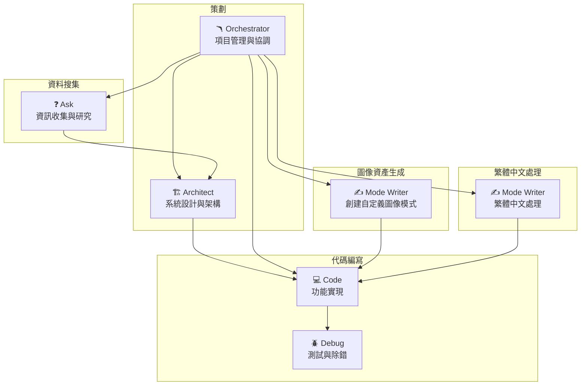

# 交通捉伊人 - 項目分工文檔

## 項目概述

「交通捉伊人」是一款結合交通運輸元素的捉迷藏遊戲，遊戲特色包括：
- **體力值系統**：玩家行動消耗體力，需要策略性管理
- **金錢系統**：用於購買交通工具票券或特殊道具
- **交通運輸機制**：玩家可以跑步或乘坐交通工具來追捕或逃避對手
- **時間限制**：在限定時間內完成追捕或成功逃脫

---

## 角色分工與 Roo Code 模式對應

### 1. 策劃 (Planning/Design)

負責遊戲整體設計、系統架構規劃及項目管理。

| 模式 | 圖標 | 職責描述 |
|------|------|----------|
| **Architect** | 🏗️ | 負責遊戲系統設計、遊戲機制規劃、技術架構設計。包括設計體力值消耗公式、金錢系統平衡、交通工具屬性設定、地圖結構規劃等核心遊戲機制。 |
| **Orchestrator** | 🪃 | 負責工作流程協調與項目管理。統籌各個開發階段的任務分配，確保團隊成員之間的協作順暢，追蹤項目進度並處理跨領域的複雜任務。 |

---

### 2. 資料搜集 (Research/Data Collection)

負責收集遊戲開發所需的各類資訊與參考資料。

| 模式 | 圖標 | 職責描述 |
|------|------|----------|
| **Ask** | ❓ | 負責資訊收集、遊戲機制研究、技術文檔分析。研究類似遊戲的設計案例、收集交通運輸相關數據、分析遊戲平衡性參數、調研技術實現方案，為策劃和開發提供參考依據。 |

---

### 3. 代碼編寫 (Code Development)

負責遊戲功能實現、程式開發及質量保證。

| 模式 | 圖標 | 職責描述 |
|------|------|----------|
| **Code** | 💻 | 負責功能實現、遊戲邏輯編寫。實現體力值系統、金錢系統、交通工具移動邏輯、玩家追捕/逃跑機制、計時系統、地圖渲染、網絡同步等核心遊戲功能。 |
| **Debug** | 🪲 | 負責測試、除錯及質量保證。系統性地測試遊戲功能、診斷問題根源、分析錯誤日誌、修復程式漏洞，確保遊戲運行穩定且無重大缺陷。 |

---

### 4. 圖像資產生成 (Image Asset Generation)

負責遊戲視覺素材的設計與生成。

| 模式 | 圖標 | 職責描述 |
|------|------|----------|
| **Mode Writer** | ✍️ | **建議：使用此模式創建自定義圖像生成模式。** 由於目前標準模式中沒有專門用於圖像生成的模式，建議使用 Mode Writer 創建一個客製化的「Image Generator」模式，專門負責生成遊戲所需的視覺資產，包括：角色立繪、交通工具圖標、地圖元素、UI 介面設計、遊戲道具圖示等。 |

> ⚠️ **注意**：目前 Roo Code 沒有內建的圖像生成標準模式。建議優先使用 Mode Writer 創建自定義模式來處理圖像資產生成任務。

---

### 5. 繁體中文處理 (Traditional Chinese Processing)

負責遊戲介面與內容的繁體中文處理。

| 模式 | 圖標 | 職責描述 |
|------|------|----------|
| **Mode Writer** | ✍️ | 負責遊戲介面的繁體中文處理(包括校對, 潤飾)。確保遊戲文本符合繁體中文使用習慣，提升本地化品質。 |

---

## 模式分工總覽

---

## Configuration Profile 配置

根據各模式的職責特性，以下為每個模式分配適合的 AI 配置文件：

### 可用配置文件

| 配置文件 | 類型 | 特點 |
|----------|------|------|
| Claude-Opus(Thinking) | 推理型 | 最強大的深度推理能力，適合複雜架構設計與規劃 |
| Claude-Sonnet(Thinking) | 推理型 | 平衡推理能力與效率，適合分析與除錯 |
| Claude-Haiku(Thinking) | 推理型 | 快速推理響應，適合日常編碼任務 |
| GPT(Thinking) | 推理型 | 強大的思維鏈推理，適合架構設計 |
| GPT(Coding) | 編碼型 | 專門優化的編碼能力 |
| Gemini-Pro(Thinking) | 推理型 | 優秀的多模態理解與推理 |
| Gemini-Pro(Image) | 圖像型 | 專門的圖像生成與理解能力 |
| DeepSeek-R1 | 推理型 | 開源強推理模型，適合複雜問題分析 |
| Qwen-Coder | 編碼型 | 優秀的代碼理解與生成能力 |
| Qwen-Coder(Plus) | 編碼型 | 增強版編碼能力，適合複雜編碼任務 |
| Ernie-4.0 | 通用型 | 百度文心大模型，中文理解能力出色 |
| GLM(Thinking) | 推理型 | 適合中文語境分析與處理 |
| Doubao-Seed(Thinking) | 推理型 | 適合中文內容生成與潤飾 |
| SparkDesk-3.5 | 通用型 | 科大訊飛模型，中文能力強 |
| Z-Image-Turbo | 圖像型 | 快速圖像生成能力 |

### 模式配置分配表

| 角色類別 | 模式 | 圖標 | 配置文件分配 | 數量 |
|----------|------|------|--------------|------|
| **策劃** | Orchestrator | 🪃 | Claude-Opus(Thinking) | 1 |
| **策劃** | Architect | 🏗️ | 1. Claude-Opus(Thinking) 2. GPT(Thinking) 3. DeepSeek-R1 | 3 |
| **資料搜集** | Ask | ❓ | 1. Gemini-Pro(Thinking) 2. Ernie-4.0 | 2 |
| **代碼編寫** | Code | 💻 | 1. Claude-Haiku(Thinking) 2. GPT(Coding) 3. Qwen-Coder(Plus) | 3 |
| **代碼編寫** | Debug | 🪲 | 1. Qwen-Coder 2. Claude-Sonnet(Thinking) | 2 |
| **圖像資產生成** | Mode Writer | ✍️ | 1. Gemini-Pro(Image) 2. Z-Image-Turbo | 2 |
| **繁體中文處理** | Mode Writer | ✍️ | 1. GLM(Thinking) 2. Doubao-Seed(Thinking) 3. SparkDesk-3.5 | 3 |

### 配置分配詳解

#### 🪃 Orchestrator（項目協調）
- **Claude-Opus(Thinking)**：最強大的推理能力，能夠處理複雜的工作流程協調與多任務管理

#### 🏗️ Architect（系統架構）
- **Claude-Opus(Thinking)**：首選，複雜系統設計需要深度推理
- **GPT(Thinking)**：備選，強大的架構思維能力
- **DeepSeek-R1**：第三選擇，開源推理模型提供不同視角

#### ❓ Ask（資料搜集）
- **Gemini-Pro(Thinking)**：多模態理解能力，適合搜集與分析各類資料
- **Ernie-4.0**：中文理解出色，適合處理中文遊戲相關資訊

#### 💻 Code（代碼編寫）
- **Claude-Haiku(Thinking)**：快速響應的推理編碼，日常開發首選
- **GPT(Coding)**：專門優化的編碼能力
- **Qwen-Coder(Plus)**：增強版代碼生成，處理複雜編碼任務

#### 🪲 Debug（除錯測試）
- **Qwen-Coder**：優秀的代碼理解能力，快速定位問題
- **Claude-Sonnet(Thinking)**：深度分析能力，處理複雜除錯場景

#### ✍️ Mode Writer（圖像資產生成）
- **Gemini-Pro(Image)**：專門的圖像生成能力，適合創建視覺資產
- **Z-Image-Turbo**：快速圖像生成，適合批量生成或快速預覽

#### ✍️ Mode Writer（繁體中文處理）
- **GLM(Thinking)**：具備優秀的中文邏輯推理能力
- **Doubao-Seed(Thinking)**：適合中文內容的生成與潤飾
- **SparkDesk-3.5**：強大的中文語言處理能力

### 配置建議

```mermaid
graph TB
    subgraph 推理型配置
        CO[Claude-Opus Thinking]
        CS[Claude-Sonnet Thinking]
        CH[Claude-Haiku Thinking]
        GT[GPT Thinking]
        GM[Gemini-Pro Thinking]
        DS[DeepSeek-R1]
        GL[GLM Thinking]
        DB[Doubao-Seed Thinking]
    end
    
    subgraph 編碼型配置
        GC[GPT Coding]
        QC[Qwen-Coder]
        QCP[Qwen-Coder Plus]
    end
    
    subgraph 圖像型配置
        GI[Gemini-Pro Image]
        ZI[Z-Image-Turbo]
    end
    
    subgraph 通用型配置
        ER[Ernie-4.0]
        SD[SparkDesk-3.5]
    end
    
    CO --> Orchestrator[🪃 Orchestrator]
    CO --> Architect[🏗️ Architect]
    GT --> Architect
    DS --> Architect
    
    GM --> Ask[❓ Ask]
    ER --> Ask
    
    CH --> Code[💻 Code]
    GC --> Code
    QCP --> Code
    
    QC --> Debug[🪲 Debug]
    CS --> Debug
    
    GI --> ModeWriterImg[✍️ Mode Writer<br/>圖像資產]
    ZI --> ModeWriterImg
    
    GL --> ModeWriterTC[✍️ Mode Writer<br/>繁體中文]
    DB --> ModeWriterTC
    SD --> ModeWriterTC
```

> 💡 **使用建議**：
> - **複雜架構設計**：優先使用 Claude-Opus(Thinking) 或 GPT(Thinking)
> - **日常編碼**：使用 Claude-Haiku(Thinking) 或 Qwen-Coder(Plus) 以提升效率
> - **中文資料處理**：Ernie-4.0 與 GLM(Thinking) 具備出色的中文理解能力
> - **圖像資產生成**：使用 Gemini-Pro(Image) 或 Z-Image-Turbo 處理視覺資產需求

---

## 備註

- 每個角色可分配 1-3 個 Roo Code 模式
- 模式之間可以相互協作，透過 Orchestrator 進行統籌管理
- 圖像資產生成建議創建專屬的自定義模式以獲得最佳效果
- 開發過程中可根據實際需求調整模式分配
