# 交通捉伊人 - 專案架構文檔

> 📋 本文檔由 **Orchestrator** 撰寫，記載專案的技術架構與遊戲系統架構，並詳細說明各架構組件對應的分工責任。

---

## 目錄

1. [專案架構總覽](#專案架構總覽)
2. [技術架構](#技術架構)
3. [遊戲系統架構](#遊戲系統架構)
4. [架構分工對應表](#架構分工對應表)
5. [開發階段規劃](#開發階段規劃)

---

## 專案架構總覽

「交通捉伊人」採用分層架構設計，將系統劃分為多個獨立模組，便於開發、測試與維護。

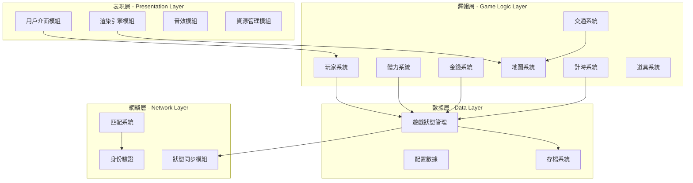

---

## 技術架構

> ⚠️ **注意**：技術選型尚未最終決定，以下列出可選方案供評估。

### 2.1 技術選型候選方案

| 方案 | 前端/客戶端 | 後端 | 數據庫 | 適用場景 |
|------|-------------|------|--------|----------|
| **方案 A - Web 技術** | Phaser.js / PixiJS | Node.js + Express | MongoDB / Redis | 瀏覽器遊戲、快速原型 |
| **方案 B - Unity** | Unity Engine + C# | ASP.NET Core | PostgreSQL | 跨平台、高性能需求 |
| **方案 C - 輕量 Web** | HTML5 Canvas + TypeScript | Firebase | Firestore | 小型專案、快速部署 |

### 2.2 技術架構分層設計

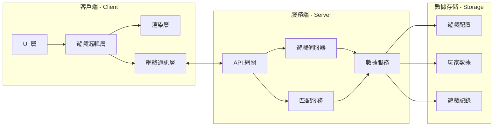

### 2.3 模組詳細設計

#### 2.3.1 表現層模組

| 模組名稱 | 功能描述 | 主要職責 | 負責模式 |
|----------|----------|----------|----------|
| **UI 模組** | 用戶介面管理 | 遊戲選單、HUD 顯示、玩家狀態面板、交通工具選擇介面 | 💻 Code |
| **渲染模組** | 畫面渲染 | 地圖渲染、角色動畫、交通工具動畫、視覺特效 | 💻 Code |
| **音效模組** | 聲音管理 | 背景音樂、音效播放、音量控制 | 💻 Code |
| **資源模組** | 資源載入 | 圖片載入、音效載入、資源快取、載入進度管理 | 💻 Code |

#### 2.3.2 邏輯層模組

| 模組名稱 | 功能描述 | 主要職責 | 負責模式 |
|----------|----------|----------|----------|
| **玩家系統** | 玩家控制與狀態 | 玩家角色控制、追捕者/逃跑者角色切換、位置更新 | 💻 Code |
| **體力系統** | 體力值管理 | 體力消耗計算、體力恢復、體力不足限制 | 💻 Code |
| **金錢系統** | 遊戲貨幣管理 | 金錢獲取、消費、餘額檢查 | 💻 Code |
| **交通系統** | 交通工具邏輯 | 交通工具屬性、乘坐邏輯、路線規劃 | 💻 Code |
| **地圖系統** | 遊戲地圖管理 | 地圖數據、路徑計算、區域劃分、交通站點 | 💻 Code |
| **計時系統** | 遊戲時間控制 | 遊戲倒計時、時間事件觸發、回合管理 | 💻 Code |
| **道具系統** | 道具功能 | 道具購買、使用、效果計算 | 💻 Code |

#### 2.3.3 數據層模組

| 模組名稱 | 功能描述 | 主要職責 | 負責模式 |
|----------|----------|----------|----------|
| **狀態管理** | 遊戲狀態統一管理 | 全局狀態存儲、狀態更新通知、狀態快照 | 💻 Code |
| **配置數據** | 遊戲配置管理 | 遊戲平衡參數、交通工具數據、地圖配置 | 🏗️ Architect |
| **存檔系統** | 遊戲進度保存 | 本地存檔、雲端同步、存檔讀取 | 💻 Code |

#### 2.3.4 網絡層模組

| 模組名稱 | 功能描述 | 主要職責 | 負責模式 |
|----------|----------|----------|----------|
| **狀態同步** | 多人遊戲同步 | 位置同步、狀態同步、延遲補償 | 💻 Code |
| **匹配系統** | 玩家匹配 | 房間創建、玩家匹配、遊戲開始邏輯 | 💻 Code |
| **身份驗證** | 用戶認證 | 登入驗證、會話管理、權限控制 | 💻 Code |

---

## 遊戲系統架構

### 3.1 核心遊戲循環

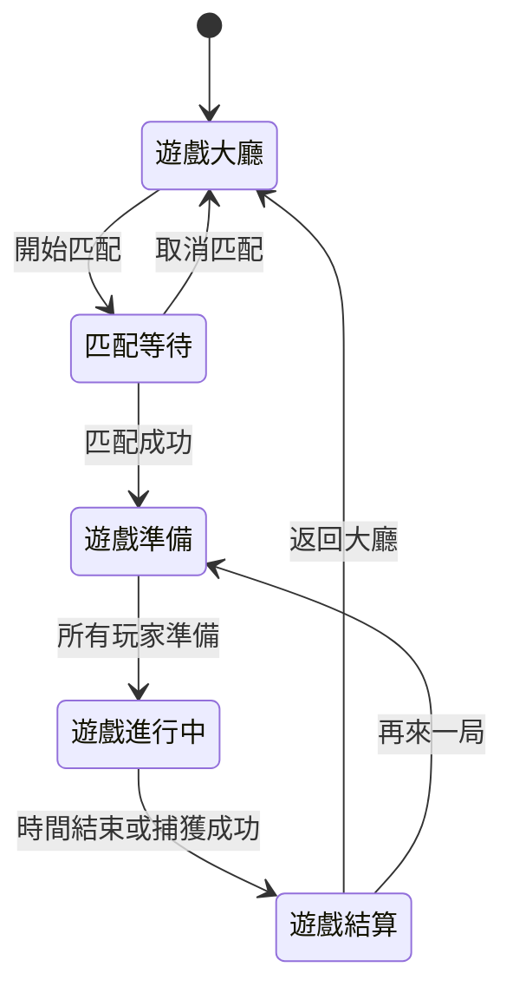

### 3.2 玩家系統設計

#### 3.2.1 角色類型

| 角色 | 描述 | 勝利條件 | 特殊能力 |
|------|------|----------|----------|
| **追捕者** | 負責在時間內捕獲逃跑者 | 捕獲所有逃跑者 | 更高移動速度、追蹤道具 |
| **逃跑者** | 在時間內躲避追捕 | 存活至時間結束 | 隱藏技能、干擾道具 |

#### 3.2.2 玩家狀態機

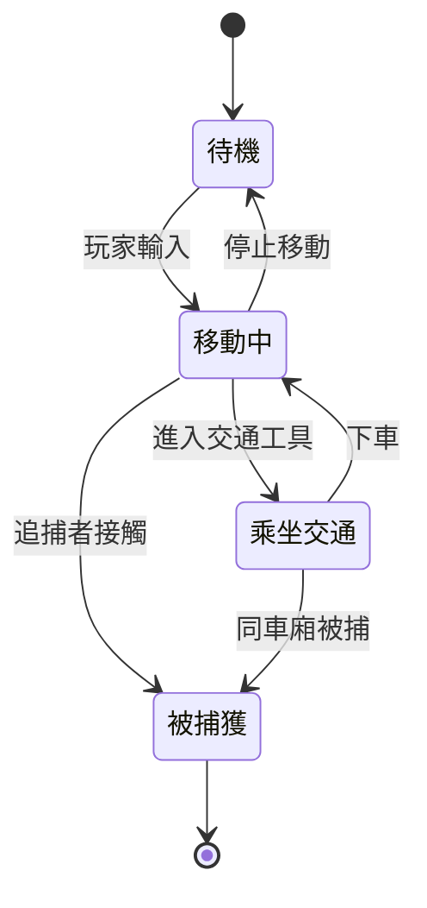

### 3.3 體力系統設計

#### 3.3.1 體力消耗規則

| 行動類型 | 體力消耗 | 備註 |
|----------|----------|------|
| 步行 | 1 點/格 | 基礎移動 |
| 跑步 | 3 點/格 | 速度加倍 |
| 使用道具 | 5-10 點 | 依道具而定 |
| 待機 | 0 點 | 自動恢復 |

#### 3.3.2 體力恢復機制

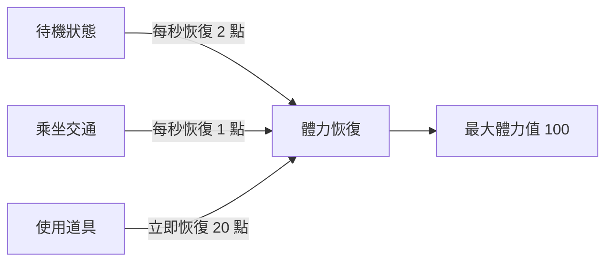

### 3.4 金錢系統設計

#### 3.4.1 金錢來源

| 來源 | 獲得金額 | 說明 |
|------|----------|------|
| 遊戲開始 | 100 元 | 初始資金 |
| 成功逃脫 | +50 元 | 逃跑者獎勵 |
| 成功捕獲 | +30 元 | 追捕者獎勵 |
| 時間獎勵 | +10 元/分鐘 | 存活時間獎勵 |

#### 3.4.2 金錢用途

| 用途 | 花費 | 說明 |
|------|------|------|
| 公車票 | 10 元 | 乘坐公車 |
| 地鐵票 | 20 元 | 乘坐地鐵 |
| 計程車 | 30 元 | 快速移動 |
| 道具購買 | 15-50 元 | 各類道具 |

### 3.5 交通系統設計

#### 3.5.1 交通工具屬性

| 交通工具 | 速度 | 費用 | 路線限制 | 體力消耗 |
|----------|------|------|----------|----------|
| **步行** | 1x | 免費 | 無 | 1 點/格 |
| **公車** | 2x | 10 元 | 固定路線 | 0 |
| **地鐵** | 3x | 20 元 | 站點間 | 0 |
| **計程車** | 2.5x | 30 元 | 自由 | 0 |

#### 3.5.2 交通網絡架構

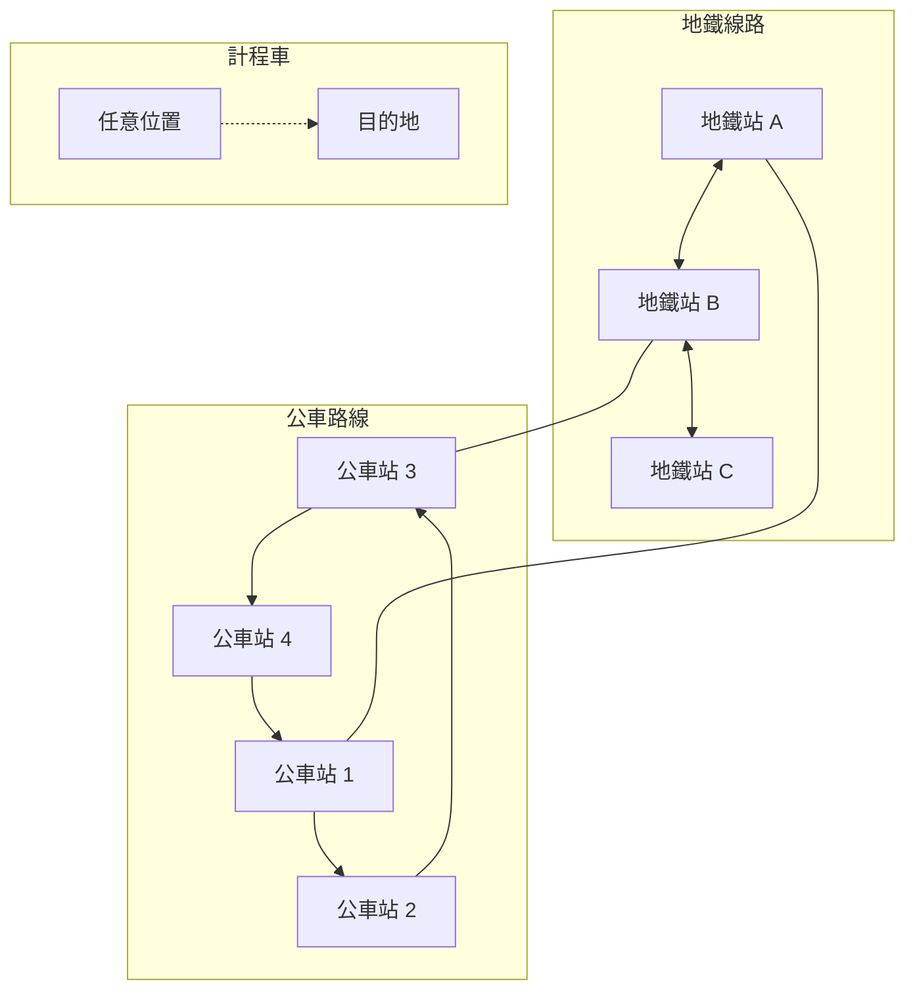

### 3.6 地圖系統設計

#### 3.6.1 地圖結構

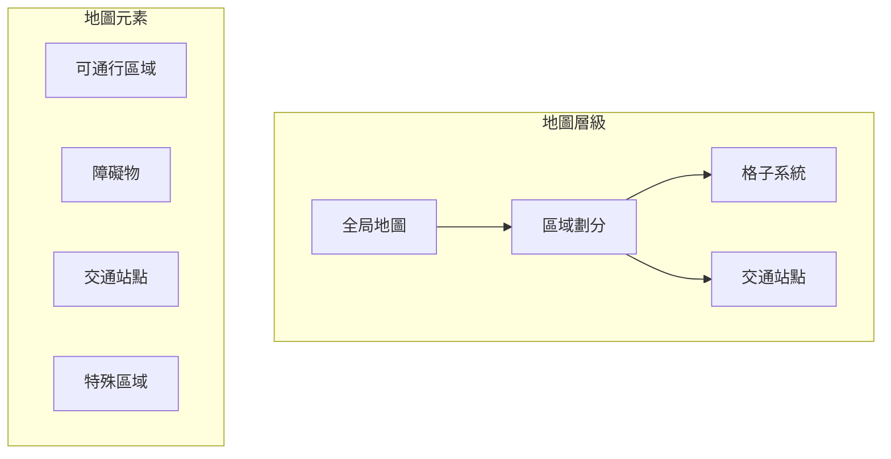

#### 3.6.2 地圖數據結構

| 數據類型 | 描述 | 負責模式 |
|----------|------|----------|
| 地圖格子數據 | 二維陣列存儲地圖信息 | 🏗️ Architect 設計 / 💻 Code 實現 |
| 路徑數據 | 交通路線定義 | 🏗️ Architect 設計 / 💻 Code 實現 |
| 站點數據 | 交通站點位置與屬性 | 🏗️ Architect 設計 / 💻 Code 實現 |

### 3.7 計時系統設計

| 計時類型 | 時長 | 說明 |
|----------|------|------|
| 遊戲總時長 | 5-10 分鐘 | 可配置 |
| 準備階段 | 30 秒 | 逃跑者先行 |
| 道具冷卻 | 10-30 秒 | 依道具而定 |

---

## 架構分工對應表

### 4.1 架構設計分工

| 架構層級 | 組件 | 設計職責 | 實現職責 | 測試職責 | 資料支援 |
|----------|------|----------|----------|----------|----------|
| **表現層** | UI 模組 | 🏗️ Architect | 💻 Code | 🪲 Debug | ❓ Ask |
| **表現層** | 渲染模組 | 🏗️ Architect | 💻 Code | 🪲 Debug | ❓ Ask |
| **表現層** | 音效模組 | 🏗️ Architect | 💻 Code | 🪲 Debug | - |
| **表現層** | 資源模組 | 🏗️ Architect | 💻 Code | 🪲 Debug | - |
| **邏輯層** | 玩家系統 | 🏗️ Architect | 💻 Code | 🪲 Debug | ❓ Ask |
| **邏輯層** | 體力系統 | 🏗️ Architect | 💻 Code | 🪲 Debug | ❓ Ask |
| **邏輯層** | 金錢系統 | 🏗️ Architect | 💻 Code | 🪲 Debug | ❓ Ask |
| **邏輯層** | 交通系統 | 🏗️ Architect | 💻 Code | 🪲 Debug | ❓ Ask |
| **邏輯層** | 地圖系統 | 🏗️ Architect | 💻 Code | 🪲 Debug | ❓ Ask |
| **邏輯層** | 計時系統 | 🏗️ Architect | 💻 Code | 🪲 Debug | - |
| **邏輯層** | 道具系統 | 🏗️ Architect | 💻 Code | 🪲 Debug | ❓ Ask |
| **數據層** | 狀態管理 | 🏗️ Architect | 💻 Code | 🪲 Debug | - |
| **數據層** | 配置數據 | 🏗️ Architect | 💻 Code | 🪲 Debug | ❓ Ask |
| **數據層** | 存檔系統 | 🏗️ Architect | 💻 Code | 🪲 Debug | - |
| **網絡層** | 狀態同步 | 🏗️ Architect | 💻 Code | 🪲 Debug | ❓ Ask |
| **網絡層** | 匹配系統 | 🏗️ Architect | 💻 Code | 🪲 Debug | - |
| **網絡層** | 身份驗證 | 🏗️ Architect | 💻 Code | 🪲 Debug | - |
| **資產** | 圖像資源 | 🏗️ Architect | ✍️ Mode Writer | - | ❓ Ask |
| **資產** | 繁體中文 | 🏗️ Architect | ✍️ Mode Writer | - | - |

### 4.2 模式職責詳細說明

#### 🪃 Orchestrator - 項目協調

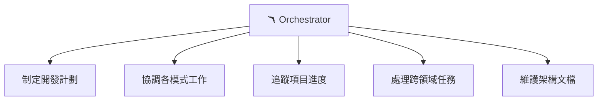

**職責範圍**：
- 統籌整個專案的開發流程
- 分配架構組件的開發任務
- 協調 Architect、Code、Debug 之間的工作交接
- 維護 `structure.md` 與 `duty.md` 的一致性

#### 🏗️ Architect - 系統設計

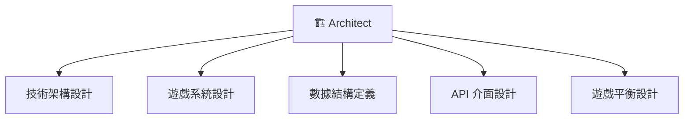

**職責範圍**：
- 設計各層級的技術架構
- 定義遊戲系統的規則與參數
- 設計數據結構與介面規範
- 確保系統的可擴展性與維護性

#### ❓ Ask - 資料搜集

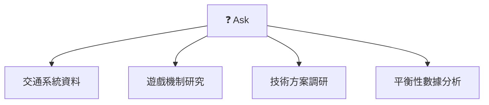

**職責範圍**：
- 搜集真實交通系統數據作為參考
- 研究類似遊戲的設計案例
- 調研技術實現方案
- 提供遊戲平衡性數據分析

#### 💻 Code - 功能實現

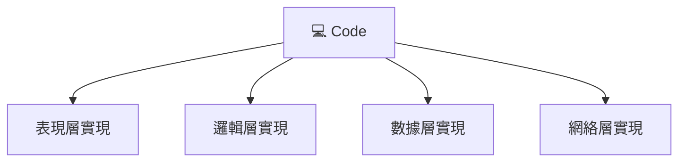

**職責範圍**：
- 根據 Architect 設計實現各模組功能
- 編寫遊戲核心邏輯代碼
- 實現 UI 介面與交互功能
- 實現網絡通訊功能

#### 🪲 Debug - 測試除錯

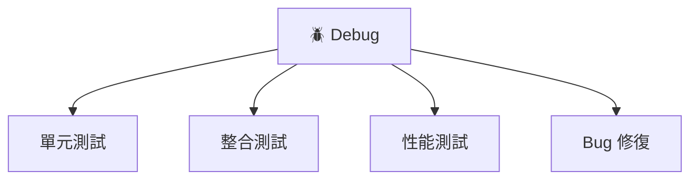

**職責範圍**：
- 為各模組編寫測試用例
- 執行系統整合測試
- 診斷並修復程式漏洞
- 性能優化與問題排查

#### ✍️ Mode Writer - 圖像資產

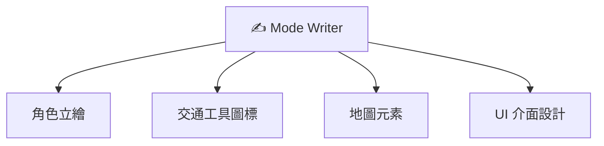

**職責範圍**：
- 生成遊戲所需的視覺資產
- 設計角色與交通工具外觀
- 創建地圖視覺元素
- 設計 UI 介面視覺風格

#### ✍️ Mode Writer - 繁體中文處理

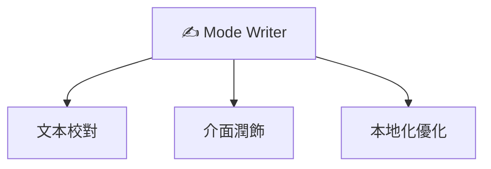

**職責範圍**：
- 負責遊戲介面的繁體中文處理
- 確保文本符合繁體中文使用習慣
- 進行內容校對與潤飾

---

## 開發階段規劃

### 5.1 階段總覽

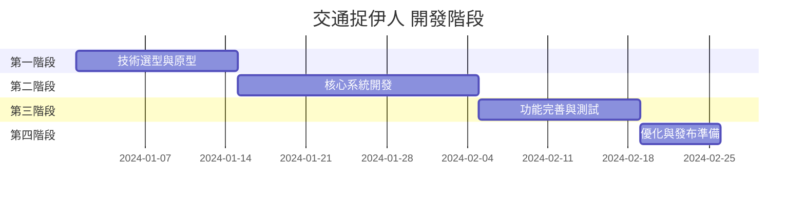

### 5.2 階段詳細說明

#### 第一階段：技術選型與原型

| 任務 | 負責模式 | 交付物 |
|------|----------|--------|
| 技術方案評估 | ❓ Ask + 🏗️ Architect | 技術選型報告 |
| 基礎架構搭建 | 💻 Code | 專案骨架代碼 |
| 核心機制原型 | 💻 Code | 可運行原型 |

#### 第二階段：核心系統開發

| 任務 | 負責模式 | 交付物 |
|------|----------|--------|
| 玩家系統實現 | 💻 Code | 玩家控制功能 |
| 體力/金錢系統 | 💻 Code | 資源管理功能 |
| 交通系統實現 | 💻 Code | 交通工具功能 |
| 地圖系統實現 | 💻 Code | 遊戲地圖 |
| 視覺資源生成 | ✍️ Mode Writer | 遊戲圖像資產 |

#### 第三階段：功能完善與測試

| 任務 | 負責模式 | 交付物 |
|------|----------|--------|
| 網絡功能實現 | 💻 Code | 多人遊戲功能 |
| 系統整合測試 | 🪲 Debug | 測試報告 |
| Bug 修復 | 🪲 Debug | 修復記錄 |
| UI/UX 優化 | 💻 Code | 優化版本 |

#### 第四階段：優化與發布準備

| 任務 | 負責模式 | 交付物 |
|------|----------|--------|
| 性能優化 | 🪲 Debug | 優化版本 |
| 最終測試 | 🪲 Debug | 最終測試報告 |
| 文檔整理 | 🏗️ Architect | 完整文檔 |
| 繁體中文優化 | ✍️ Mode Writer | 本地化版本 |
| 發布準備 | 🪃 Orchestrator | 發布版本 |

---

## 附錄

### A. 文件關聯

| 文件 | 用途 | 維護者 |
|------|------|--------|
| `duty.md` | 角色分工與配置 | 🪃 Orchestrator |
| `structure.md` | 專案架構文檔 | 🪃 Orchestrator |
| `game-design.md` | 遊戲設計文檔 | 🏗️ Architect（待建立） |
| `api-spec.md` | API 規範文檔 | 🏗️ Architect（待建立） |

### B. 術語表

| 術語 | 說明 |
|------|------|
| 追捕者 (Seeker) | 負責捕獲逃跑者的玩家角色 |
| 逃跑者 (Hider) | 需要躲避追捕的玩家角色 |
| 體力值 (Stamina) | 玩家行動消耗的資源 |
| 交通站點 | 玩家可搭乘交通工具的位置 |

---

> 📝 **文檔版本**：v1.0  
> 📅 **建立日期**：2026-01-07  
> ✍️ **撰寫者**：Orchestrator Mode  
> 🔄 **最後更新**：2026-01-07
